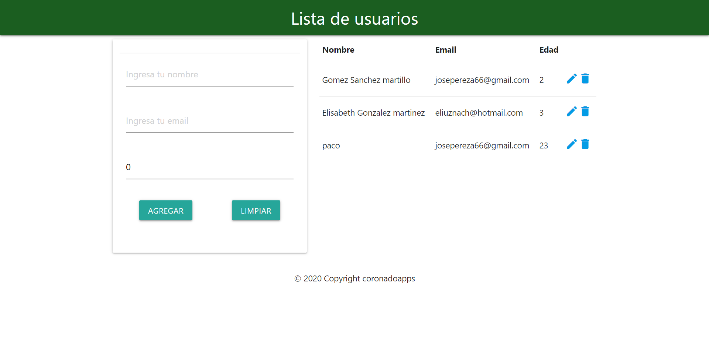

# mean-ngx-socket-io
MEAN con angular 10 , mongodb, nodejs, con realtime  y  ngx-socket-io

* https://www.npmjs.com/package/ngx-socket-io
* el codigo de abajo de ha insertado,dentro del server,  en user.routes.js  pero tambien lo podemos insertar en el index.js:
```
var server = require('http').createServer(app);
var io = require('socket.io')(server);
server.listen(5000)
io.on('connection', function (socket) {
    console.log(socket.handshake.address)
    socket.on('cambio', function (data) {
        console.log(data);
        io.emit('update-data', { data: data });
    });
});
``` 



